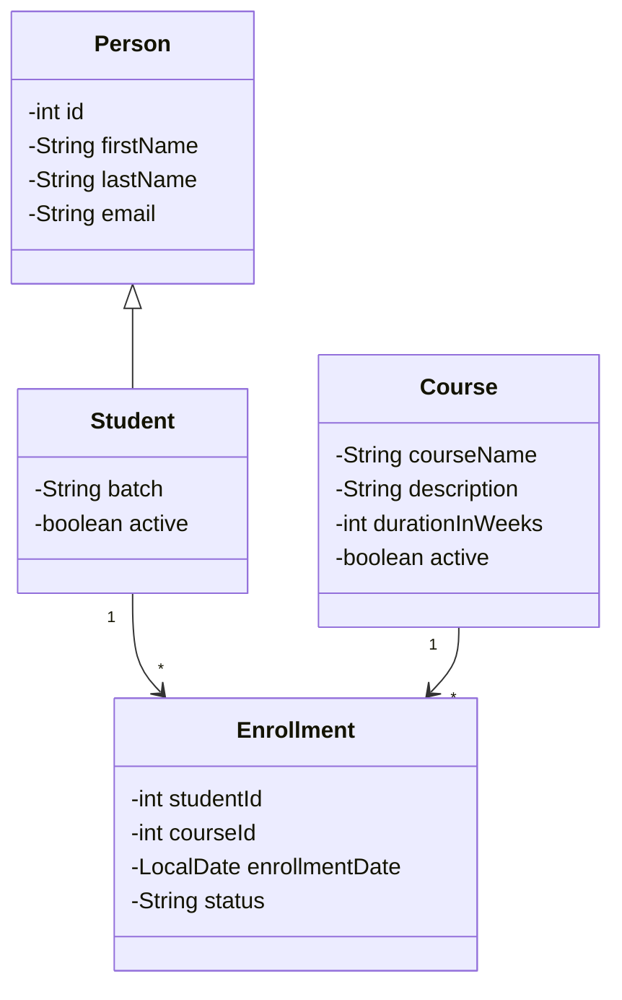
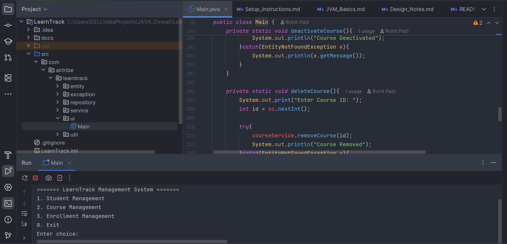

# LearnTrack: Student & Course Management System

LearnTrack is a console-based Core Java project built to manage Students, Courses, and Enrollments using OOP principles.  
It is developed as part of the assignment to practice Core Java, Collections, Encapsulation, Inheritance, Exception Handling, and Clean Code practices.

---

## 1. Features

###  Student Management
- Add Student
- View All Students
- Search Student by ID
- Activate / Deactivate Student

###  Course Management
- Add Course
- View All Courses
- Search Course by ID
- Activate / Deactivate Course

###  Enrollment Management
- Enroll Student into Course
- View Enrollments
- Update Enrollment Status (ACTIVE/COMPLETED/CANCELLED)

---

## 2. Tech Used
- Java (Core)
- ArrayList for data storage
- Console-based UI
- Exception Handling with custom exception
- Static utilities for ID generation

---

## 3. Project Structure:
```
LearnTrack/
│
├── src/com/airtribe/learntrack
│ ├── entity
│ │ ├── Person
│ │ ├── Student
│ │ ├── Course
│ │ └── Enrollment
│ ├── repository
│ │ ├── StudentRepository
│ │ ├── CourseRepository
│ │ └── EnrollmentRepository
│ ├── service
│ │ ├── StudentService
│ │ ├── CourseService
│ │ └── EnrollmentService
│ ├── exception
│ │ └── EntityNotFoundException
│ ├── util
│ │ └── IdGenerator
│ └── ui
│ └── Main (Console UI)
│
└── docs
├── Setup_Instructions.md
└── Design_Notes.md
```

---

## 4. OOP and Implementation:


| Concept | Where used |
|--------|------------|
| Encapsulation | Private fields + getters/setters in all entities |
| Inheritance | `Student extends Person` |
| Polymorphism | `toString()` overridden |
| Constructor Overloading | Student has two constructors |
| Static | ID Generator uses static counters |
| Collections | All data stored in ArrayList |
| Custom Exception | `EntityNotFoundException` implemented |

---

## 5. How to Run the Project

### Steps:
1. Open project in IntelliJ

2. Go to → src/com/airtribe/learntrack/ui/Main.java

3. Run the main() method


### You will see:

======= LearnTrack Management System =======

1. Student Management

2. Course Management

3. Enrollment Management

4. Exit

Enter choice:

---

## 6. Class Diagram



---

## 7. Design Notes:


1. Used ArrayList for dynamic data handling instead of arrays

2. Encapsulation → private fields + getters/setters

3. Inheritance + Polymorphism → Student extends Person

4. Custom Exception improves clean error handling

5. IdGenerator (static) provides unique incremental IDs

6. Clean modular architecture — Entity → Repository → Service → UI

---

## 8. Sample Output

Below is the console UI displayed when the project runs:



